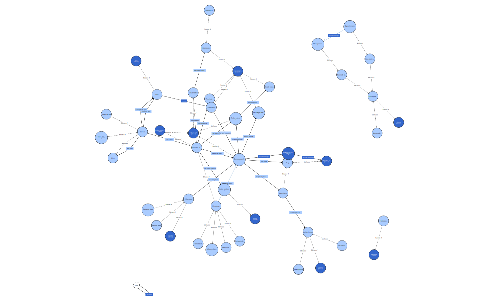

# mcbo
Bioprocessing ontology that builds on IOF process patterns and BFO foundations, with domain-specific extensions that reference OBO ontology classes for measurement, sequencing, and biological entities; designed for RNA-seq analysis, culture condition optimization, and product development.

# MCBO Project

Here is the main MCBO ontology diagram:

# **Download and View in Browser To Zoom**  
[mcbo.ttl.svg](./docs/figures/mcbo.ttl.svg)
*Open the file in Chrome (or another modern browser) to zoom and pan the image easily.*

> **To view and zoom in:**  
> Download the SVG above (right-click, **Save Link As...**), then open it in Chrome or another modern browser.  
>  
> Chrome allows you to zoom and pan easily, so you can inspect all details of the graph.

# Competency questions
CQ1: Under what culture conditions (pH, dissolved oxygen, temperature) do the cells reach peak recombinant protein productivity?
CQ2: Which cell lines have been engineered to overexpress gene Y?
CQ3: Which nutrient concentrations in cell line K are most associated with viable cell density above Z at day 6 of culture?
CQ4: How does the expression of gene X vary between clone A and clone B?
CQ5: What pathways are differentially expressed under Fed-batch vs Perfusion in cell line K?
CQ6: Which are the top genes correlated with recombinant protein productivity in the stationary phase of all experiments?
CQ7: Which genes have the highest fold change between cells with viability (>90%) and those without (<50%)? 
CQ8: Which cell lines or subclones are best suited for glycosylation profiles required for therapeutic protein X?

