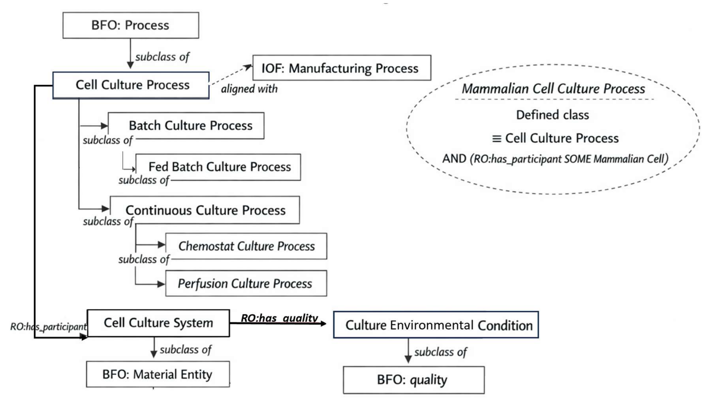

# MCBO - Mammalian Cell Bioprocessing Ontology

[](https://github.com/lewiscelllabs/mcbo/actions/workflows/qc.yml)
[](https://mcbo.readthedocs.io/en/latest/?badge=latest)


A hub-and-spoke, IOF-anchored application ontology for mammalian cell bioprocessing and RNA-seq data curation.

📖 **[Full Documentation](https://mcbo.readthedocs.io/)**

## Term Requests

Please click [New Term Request](https://github.com/lewiscelllabs/mcbo/issues/new?template=mcbo-term-request.md) to submit your request.

(Issues > New Issue > MCBO Term Request)


## Quick Start

**Pre-requisites**: 
- Conda/Miniconda (for environment management)

```bash
make conda-env
conda activate mcbo
make install
make demo
```

See the [Installation Guide](https://mcbo.readthedocs.io/en/latest/installation.html) for detailed setup instructions.

## Ontology Overview


## Competency Questions

MCBO supports 8 competency questions.

See the [full CQ documentation](https://mcbo.readthedocs.io/en/latest/index.html#competency-questions).

## LLM Agent

Answer competency questions using natural language with an LLM-powered agent:

```bash
# Install agent dependencies
make install-agent

# Set your API key
export OPENAI_API_KEY=sk-...  # or ANTHROPIC_API_KEY

# Ask questions!
mcbo-agent-eval --data-dir data.sample --cq CQ1
mcbo-agent-eval --data-dir data.sample \
  --cq "What genes are differentially expressed under Fed-batch vs Perfusion?"

# Or use local LLM (free, private)
make install-ollama
mcbo-agent-eval --data-dir data.sample --cq CQ1 --provider ollama
```

📖 **[Agent Documentation](docs/agent.md)** - Full setup, customization, and MCP server integration.

## Documentation

| Section | Description |
|---------|-------------|
| [Installation](https://mcbo.readthedocs.io/en/latest/installation.html) | Environment setup and dependencies |
| [Quick Start](https://mcbo.readthedocs.io/en/latest/quickstart.html) | Run the demo in minutes |
| [Workflows](https://mcbo.readthedocs.io/en/latest/workflows.html) | Data ingestion scenarios |
| [CLI Reference](https://mcbo.readthedocs.io/en/latest/cli.html) | Command-line tools and CSV columns |
| [Ontology Design](https://mcbo.readthedocs.io/en/latest/ontology.html) | Modeling patterns and architecture |
| [API Reference](https://mcbo.readthedocs.io/en/latest/api.html) | Python package documentation |
| [Development](https://mcbo.readthedocs.io/en/latest/development.html) | Contributing and QC checks |

## License

MIT License - see [LICENSE](LICENSE) for details.

## Citation

> MCBO: Mammalian Cell Bioprocessing Ontology, A Hub-and-Spoke, IOF-Anchored Application Ontology
> 
> Kimberly Robasky, James Morrissey, Markus Riedl, Andreas Dräger, Nicole Borth, Michael J Betenbaugh, Nathan E Lewis
> 
> bioRxiv 2026.01.05.697007; doi: https://doi.org/10.64898/2026.01.05.697007
> 
> This article is a preprint and has not been certified by peer review.

> Supersedes: Robasky, K., Morrissey, J., Riedl, M., Dräger, A., Borth, N., Betenbaugh, M. J., & Lewis, N. E. (2025). MCBO: Mammalian Cell Bioprocessing Ontology, A Hub-and-Spoke, IOF-Anchored Application Ontology. *ICBO-EAST 2025*.

---
