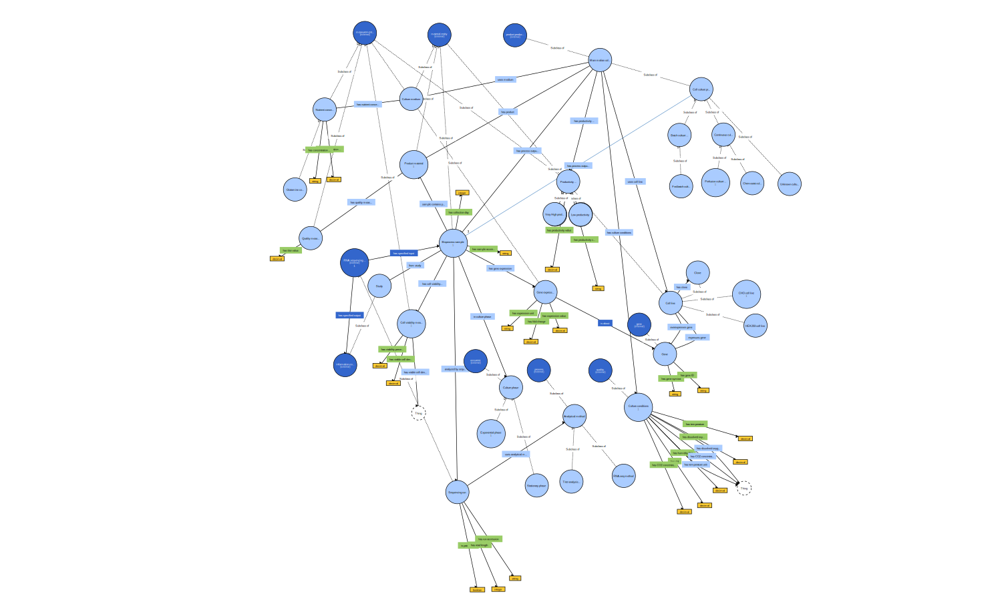

# mcbo
Bioprocessing ontology that builds on IOF process patterns and BFO foundations, with domain-specific extensions that reference OBO ontology classes for measurement, sequencing, and biological entities; designed for RNA-seq analysis, culture condition optimization, and product development. 

**New Term Request:**

Please click `'Issues'>'New Issue'>'MCBO Term Request'` to submit your request

**Please cite:**

Robasky, K., Morrissey, J., Riedl, M., Dräger, A., Borth, N., Betenbaugh, M. J., & Lewis, N. E. (2025, November 11). MCBO: Mammalian Cell Bioprocessing Ontology, a hub-and-spoke, IOF-anchored application ontology [Short talk]. 16th International Conference on Biomedical Ontology (ICBO 2025), Virtual conference. Short talk published on conference website. https://icbo-conference.github.io/icbo2025/

[](https://youtu.be/YTvCv-l0ia4)

# MCBO Project

Main MCBO ontology diagram below (click to get github doc, then right-click and open in new tab to zoom in).

- Competency question source code under `src/`
- Ontology under `ontology/`
- Slightly more implementation details under `docs/`



# Competency questions:
- CQ1: Under what culture conditions (pH, dissolved oxygen, temperature) do the cells reach peak recombinant protein productivity?
- CQ2: Which cell lines have been engineered to overexpress gene Y?
- CQ3: Which nutrient concentrations in cell line K are most associated with viable cell density above Z at day 6 of culture?
- CQ4: How does the expression of gene X vary between clone A and clone B?
- CQ5: What pathways are differentially expressed under Fed-batch vs Perfusion in cell line K?
- CQ6: Which are the top genes correlated with recombinant protein productivity in the stationary phase of all experiments?
- CQ7: Which genes have the highest fold change between cells with viability (>90%) and those without (<50%)? 
- CQ8: Which cell lines or subclones are best suited for glycosylation profiles required for therapeutic protein X?

# QC reports

The following reports were run and placed under reports/robot/; QC passes if every report is empty

```
java -jar .robot/robot.jar query \
  --input ontology/mcbo.owl.ttl \
  --query sparql/orphan_classes.rq \
reports/robot/orphan_classes.tsv

 java -jar .robot/robot.jar query \
  --input ontology/mcbo.owl.ttl \
  --query sparql/duplicate_labels.rq \
reports/robot/duplicate_labels.tsv

 java -jar .robot/robot.jar query \ 
  --input ontology/mcbo.owl.ttl \
  --query sparql/duplicate_labels.rq \
reports/robot/duplicate_labels.tsv
```
